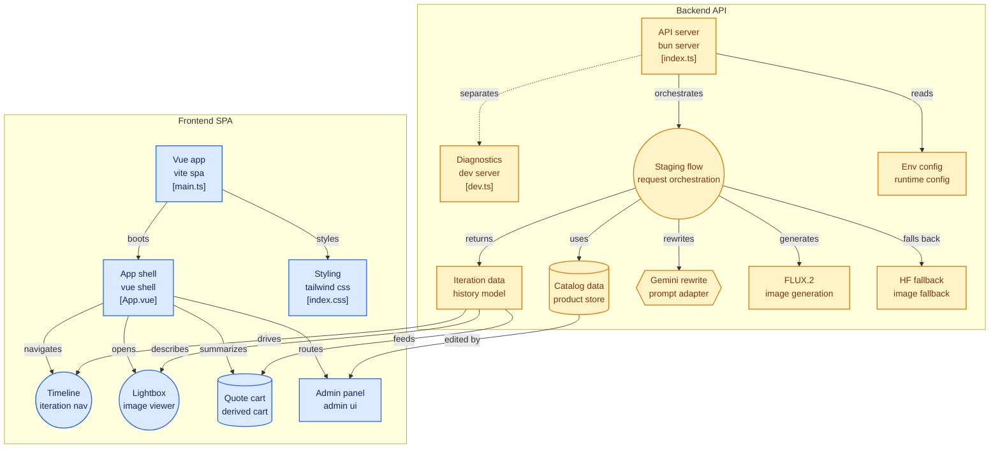

# More House Decor IA 🏠✨

**MHDecorIA-Canvas** es una aplicación web premium de **Virtual Staging Generativo por Turnos y Referencias** potenciada por Inteligencia Artificial. A diferencia de las herramientas tradicionales de pegatinas 2D ("stickers"), este MVP implementa una integración tridimensional fotorrealista donde los muebles reales del catálogo oficial de **More House S.A.** se funden orgánicamente en perspectiva, iluminación, materiales y sombras sobre la habitación cargada por el usuario.

---

## 📐 Arquitectura del Sistema

El siguiente diagrama detalla el flujo de datos y la arquitectura técnica del sistema, conectando el Frontend SPA (Vue 3 + Vite) con el Backend API (Bun + Elysia) y las integraciones de IA (Gemini, Cloudflare Workers AI y Hugging Face):



### 🔍 Desglose de Componentes e Interacciones

#### 1. Backend API (Servidor en Bun)
*   **API Server (`index.ts`)**: Servidor principal que expone los endpoints de cotización, catálogo, métricas y proxy de imágenes en el puerto 3000. Carga las variables de entorno de forma nativa.
*   **Diagnostics Server (`dev.ts`)**: Microservicio desacoplado en el puerto 3001. Evalúa el estado de conexión de las API de Google AI Studio, Cloudflare, Hugging Face y Replicate, comprobando cuotas y reportando bloqueos.
*   **Staging Flow (Orquestador de Peticiones)**: Hilo lógico de generación de diseño. Cuando se solicita un rediseño:
    1. Llama a **Gemini** pasándole la imagen de fondo y el inventario del catálogo. Gemini actúa como *curador* de productos y *redactor* de prompts adaptados a FLUX.2, vinculando los muebles seleccionados a las etiquetas físicas `input_image_1..3`.
    2. Descarga en caliente las fotos en alta resolución desde el servidor de imágenes de catálogo y las adjunta en el payload `multipart/form-data`.
    3. Invoca la API de **Cloudflare Workers AI** con el modelo FLUX.2. Si ocurre un fallo de cuota (429), realiza un fallback en caliente a **Hugging Face** con el modelo `FLUX.1-schnell`.
    4. Retorna el resultado consolidado (render final, problemas resueltos y desglose de muebles inyectados) al Frontend.

#### 2. Frontend SPA (Aplicación Single Page)
*   **Vite SPA (`main.ts` & `index.css`)**: Punto de arranque y cargador de estilos unificados de Tailwind CSS.
*   **App Shell (`App.vue`)**: Núcleo reactivo del cliente. Orquesta la captura de preferencias, la limitación de turnos, y la comunicación con el Backend.
*   **Timeline / Iteration Nav**: Barra horizontal que permite navegar por el historial del diseño. Cada etapa actualiza la imagen base en tiempo real y recalcula el inventario actual.
*   **Lightbox / Image Viewer**: Visor modal de ampliación a pantalla completa que permite navegar por las distintas propuestas mediante transiciones y consultar el desglose de productos y presupuesto acumulado de forma aislada.
*   **Quote Cart (Carrito Acumulado)**: Sumador dinámico que lee el historial acumulado en la iteración actual para consolidar el total presupuestado y enviar el lead de cotización.
*   **Admin Panel (CRUD Catálogo)**: Interfaz de mantenimiento protegida por credenciales administrativas que permite insertar, modificar y borrar productos del catálogo en tiempo real.

---

## 🌟 Características Clave

1. **Virtual Staging por Turnos (Multi-Reference Staging)**:
   * Permite subir una foto de una habitación vacía (o amueblada) y decorarla progresivamente por etapas ("turnos").
   * En cada turno, el usuario puede seleccionar manualmente hasta **3 productos del catálogo** o ingresar una instrucción en texto libre para que la IA los seleccione de forma inteligente.
   * El sistema genera un render tridimensional integrado utilizando **Cloudflare Workers AI FLUX.2** con soporte multi-referencia física (`input_image_1..3`).

2. **Línea de Tiempo Sidebar (Historial del Turnos)**:
   * Registra cada iteración de diseño (`Original` ➔ `Etapa 1` ➔ `Etapa 2` ➔ ...).
   * Permite navegar libremente por el historial para restaurar una versión anterior como la base activa, permitiendo deshacer cambios o ramificar el diseño en otras combinaciones.

3. **Galería de Iteraciones Lightbox (Ampliado Premium)**:
   * Visor de renderizado clickeable con zoom hover interactivo.
   * Modal a pantalla completa (`backdrop-blur-md`) que permite visualizar los diseños a gran escala con controles de navegación (`anterior` / `siguiente`) y acceso directo a través de miniaturas.
   * Muestra a detalle la evaluación de la IA, el prompt exacto utilizado y el mobiliario colocado en esa iteración.

4. **Carrito de Cotización Acumulado**:
   * Desglosa de forma automática todos los productos agregados a lo largo de las distintas etapas de la sesión de diseño activa.
   * Calcula el presupuesto total en tiempo real y permite solicitar la cotización completa de los muebles con un solo clic.

5. **Servidor de Diagnóstico y Robustez**:
   * Diagnósticos en caliente de las cuotas y estados de las API en el puerto 3001.
   * **Fallback de Gemini**: Si se agota la cuota gratuita de la API de Gemini, el backend construye dinámicamente un prompt en inglés que enlaza las referencias de imagen, asegurando que tus muebles de catálogo se sigan pintando.
   * **Fallback de Generación (Hugging Face)**: Si se agotan los 10,000 neuronas gratuitas diarias de tu cuenta de Cloudflare, la app cambia automáticamente a Hugging Face `FLUX.1-schnell` de forma transparente.

---

## 🛠️ Requisitos Previos

Dado que el proyecto utiliza tecnologías de alto rendimiento modernas, es indispensable tener instalado **Bun**:
*   **Instalación rápida en Windows (PowerShell):**
    ```powershell
    powershell -c "irm bun.sh/install.ps1 | iex"
    ```
*   **Instalación en macOS / Linux:**
    ```bash
    curl -fsSL https://bun.sh/install | bash
    ```

---

## ⚙️ Configuración del Proyecto (Post-GitHub)

Al descargar el repositorio desde GitHub, notarás que faltan las dependencias (`node_modules`) y las claves de configuración de las APIs (`.env`), ya que estas están protegidas por el archivo `.gitignore`. Sigue estos pasos para configurarlo:

### 1. Configurar las Claves de API en el Backend
Navega a la carpeta `/backend` y crea un archivo llamado **`.env`** con la siguiente estructura:

```env
GEMINI_API_KEY="TU_API_KEY_DE_GEMINI"
CLOUDFLARE_ACCOUNT_ID="TU_ACCOUNT_ID_DE_CLOUDFLARE"
CLOUDFLARE_API_TOKEN="TU_API_TOKEN_DE_CLOUDFLARE"
HF_TOKEN="TU_TOKEN_DE_HUGGING_FACE"
PORT=3000
```

*   **Gemini API Key:** Se obtiene gratis en [Google AI Studio](https://aistudio.google.com/).
*   **Hugging Face Token:** Se obtiene gratis en *Settings -> Access Tokens* en [Hugging Face](https://huggingface.co/).
*   **Cloudflare Workers AI:** Se obtiene gratis en tu cuenta de [Cloudflare](https://dash.cloudflare.com/) (sección *My Profile -> API Tokens* usando la plantilla *Workers AI*).
    > **Tip**: Si excedes el límite gratuito diario de 10,000 neuronas de Cloudflare, puedes cambiar tu plan a *Workers Paid* (desde $5 USD/mes) para habilitar el pago por uso a un costo de solo **$0.011 USD por cada 1,000 neuronas** adicionales (menos de un centavo de dólar por renderizado).

---

## 💻 Cómo Correr la Aplicación Localmente

Abre dos terminales por separado en la raíz del proyecto para ejecutar el Backend y el Frontend en paralelo:

### Terminal 1: Iniciar el Servidor (Backend)
1. Navega a la carpeta `backend`:
   ```bash
   cd backend
   ```
2. Instala las dependencias con Bun:
   ```bash
   bun install
   ```
3. Levanta el servidor en modo desarrollo (con auto-recarga en caliente `--hot`):
   ```bash
   bun run dev
   ```
   *El backend estará corriendo en: [http://localhost:3000](http://localhost:3000)*
   *Opcional: Para levantar el servidor de diagnóstico de API, ejecuta `bun run dev:models` en el puerto 3001.*

### Terminal 2: Iniciar la Webapp (Frontend)
1. Navega a la carpeta `frontend`:
   ```bash
   cd ../frontend
   ```
2. Instala las dependencias:
   ```bash
   bun install
   ```
3. Inicia el servidor de desarrollo de Vite:
   ```bash
   bun run dev
   ```
   *El frontend estará listo y accesible en: [http://localhost:5173](http://localhost:5173)*

---

## 🔑 Credenciales para Pruebas del Panel Administrador

Para probar el panel administrativo del catálogo, ve a la pestaña **Administrador** e inicia sesión con estas credenciales:
*   **Usuario:** `admin`
*   **Contraseña:** `admin123`

Desde allí podrás simular el inventario agregando, editando o eliminando muebles reales de la base de datos local y verás cómo la IA de Gemini los prioriza en sus recomendaciones.
